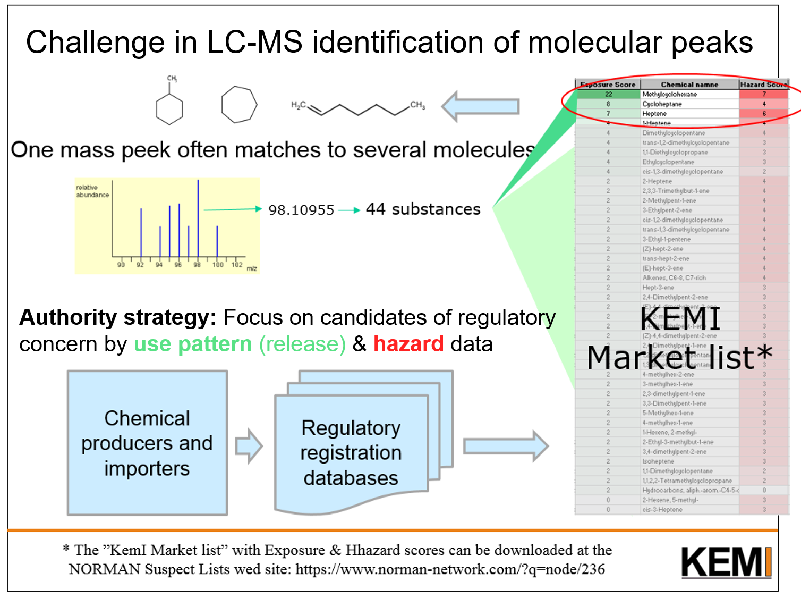

```{r setup, include=FALSE}
knitr::opts_chunk$set(echo = FALSE, warning = FALSE, eval = TRUE)

options(knitr.kable.NA = '')

library(tidyverse)
library(knitr)
library(kableExtra)
library(readxl)
library(flextable)

typelatex <- is_latex_output()

if (is_latex_output() == TRUE){
  options(knitr.table.format = "latex")
  
} else {
  options(knit.r.table.format = "markdown")
  
  set_flextable_defaults(
    font.family = "Garmond", 
    font.size = 8,
    font.color = "black",
    table.layout = "autofit",
    digits = 1,
    theme_fun = "theme_booktabs"
  )
  
  background_fill <- function(df){
    
    if(nrow(df) %% 2 == 0){
      rep(c(TRUE, FALSE), (nrow(df))/2)
    } else {
      c(rep(c(TRUE, FALSE), (nrow(df))/2), TRUE)
    }
  } 
  
}

# function to add extra to the YAML header
not_pdf <- function(){
  if(is_latex_output() == TRUE){
    FALSE 
  } else {
    TRUE
  }
}

```

```{asis, echo = not_pdf()}
---
title: "Maximizing output from non-target screening"
author: "Birgitta Andreasen, Bert van Bavel, Stellan Fischer, Peter Haglund, Pawel Rostkowski, Malcom J. Reid, Saer Samanipour, Martin Schlabach, Cathrin Veenaas, and Maria Dam"
---

```


```{r include=FALSE}
#source scripts
source("scripts/import_data.r", encoding = "utf-8")

country_order <- c("Greenland", "Iceland", "Faroe Islands", "Norway", "Denmark", "Sweden", "Finland")
country_labels <- c("GL", "IS", "FO", "NO", "DK", "SE", "FI")
```


\newpage

# Introduction

## Project background

In recent years, there has been a paradigm shift in chemical analysis, which has been possible with the introduction of chromatography in combination with high-resolution accurate mass spectrometry (for example QTOF or Orbitrap). This means that the analyzes can to a greater extent be used to detect new chemicals in, for example, environmental samples, without having decided in advance what to look for. This opens up a field with extreme potential in relation to environmental monitoring and in extension of this also in relation to the possibility of starting the regulation process for new substances that constitute a potential health and/or environmental hazard.

Under the Nordic Screening Group (www.nordicscreening.org), and with support from the Nordic Chemical Group (NKG) and the Nordic Marine Group (HAV), a suspect screening analysis was performed in 2015 and 2016, which was based precisely on such sophisticated analysis methods just mentioned. The results were published by Schlabach and co-workers in the TemaNord 2017:561 report [@Schlabach2017].

By using these advanced chemical analyzes methods, a large amount of data is generated, as was the case for the Nordic Screening project [@Schlabach2017]. However, the interpretation possibilities of this data are currently limited by databases that have largely been institution-specific, in addition to often being instrument-specific by proprietary software, and of course by the availability of resources in the form of man-hours. There is a great deal of work involved in interpreting analysis data in relation to which chemical substances they represent, and this is the background for this current project. There is a wealth of data on chemical substances in the Nordic samples - but it has only been possible to unambiguously identify a small part of these. Another need in relation to optimal use of this data is the need of a description of the identified substance in relation to whether it is a natural or an anthropogenic from the technosphere.

## Project aim and method

The purpose of this project is to optimize the benefits of the major work that has already been done with careful sample selection and sampling in all of the Nordic countries, with meticulous sample preparation and chemical analysis by a consortium of some of the Nordic region’s most experienced scientific groups in analyses of emerging environmental contaminants. But where perhaps the full potential of the generated data is still to be realized. This project will dig deeper into the data material and try to further identify and describe the substances already detected, to be able to better understand what substances we in modern Nordic societies release into the sea via our wastewater.


The work was divided into the following tasks:

* Semi-quantification of the compounds already identified

* Identify more of the compounds via suspect lists and quarry the digital archive files


Because this project mainly consists of data analysis and data curation of list by matching to different types of databases, the results are mainly presented as data tables. Thus, this report can be viewed as a data appendix to the initial report by Schlabach et al. [-@Schlabach2017].

Further, all the data presented in this report are available on GitHub (https://github.com/umhvorvisstovan/NKG_Maximising_output_from_non_target_screening).

The analysis and identification of compounds in the environmental matrices may be described as a tiered approach as described by Schymanski et al. [-@Schymanski2015]. In this approach the identification is classified to a levels degree, where the results of non-target screening may be ranked from low confidence data (Level 5) to high confidence data (Level 1), where Level 1 and 2 corresponds to the confidence level normally aspired to in standard monitoring analysis of environmental contaminants. The knowledge gained at the various levels corresponds to:

* **Level 1:** confirmed structure of the molecule (based on reference standard)
* **Level 2:** a probable structure (based in library/diagnostic evidence)
* **Level 3:** a tentative candidate compound 
* **Level 4:** an unequivocal molecular formular (but insufficient evidence of structure)
* **Level 5:** a (molecular/ion) mass 

In the present work, the aim has been to identify as many compounds as possible to Level 1, 2 and 3. 


## Sampling

```{r include=FALSE}
epsg <- 3035
#epsg <- 4236

world <- rnaturalearth::ne_countries(scale = 50, returnclass = "sf") %>%
  sf::st_transform(epsg)
cropp <- sf::st_sfc(sf::st_point(c(-30, 40)), sf::st_point(c(70, 80)),
                    crs = 4326) %>% 
  sf::st_transform(crs = epsg)
cropp_coord <- sf::st_coordinates(cropp)
world_cropped <- sf::st_crop(world, xmin = cropp_coord[1,"X"],
                             xmax = cropp_coord[2,"X"],
                             ymin = cropp_coord[1,"Y"],
                             ymax = cropp_coord[2,"Y"])

world_cropped_nordic <- world_cropped %>% filter(sovereignt %in% c("Greenland", "Faroe Islands", "Denmark", "Iceland", "Norway", "Denmark", "Sweden", "Finland"))

samples <- sample_info %>% 
  mutate(geometry = paste0("POINT(", longitude, " ", latitude, ")"),
         geom_country = paste0("POINT(", country_lng, " ", country_lat, ")"),
         matrix = factor(matrix, levels = c("Effluent", "Sediment", "Biota")),
         country_name = factor(country_name, levels = country_order))

sf_samples <- sf::st_as_sf(samples, wkt = "geometry", crs = 4236) %>% 
  sf::st_jitter(factor = 0.002) %>% 
  sf::st_transform(epsg)
sf_test <- sf_samples %>% cbind(sf::st_coordinates(sf_samples))

sf_samples_country <- samples %>%
  select(country_name, geom_country) %>%
  distinct_all() %>% 
  sf::st_as_sf(wkt = "geom_country", crs = 4236) %>% 
  sf::st_transform(epsg)

samplingmap <- ggplot() +
  geom_sf(data = world_cropped, colour = "grey95") +
  #geom_sf(data = world_cropped_nordic, fill = "grey85", colour = "grey95") +
  geom_point(data = sf_test, aes(x = X, y = Y, shape = matrix, colour = matrix), size = 2, alpha = 0.7) +
  #geom_sf(data = sf_samples, aes(colour = Matrix, fill = Matrix), size = 2, alpha = 0.5) +
  geom_sf_text(data = sf_samples_country, aes(label = country_name), size = 3, colour = "grey40") +
  coord_sf(expand = FALSE) +
  labs(shape = "Sample matrix:", colour = "Sample matrix:") +
  theme_minimal() +
  theme(legend.position = c(0.15, 0.15),
        axis.title = element_blank(),
        axis.text = element_blank(),
        legend.title = element_text(face = "italic"),
        panel.border = element_rect(colour = "grey50", fill = NA))
```


Figure \@ref(fig:samplingmap) depicts the sampling stations, samples were collected in the fall of 2015 in  Greenland (GL), Iceland (IS), Faroe Islands (FO), Norway (NO), Denmark (DK), Sweden (SE), and Finland (FI). Further information on each sample can be found in Table \@ref(tab:samplingtable) in Appendix \@ref(samplesappendix) and in the initial study [@Schlabach2017].

```{r samplingmap, fig.cap="Sampling stations"}
samplingmap
```

\newpage

# Semi-quantification of the compounds already identified

## Aim

The compounds detected by the GCxGC-MS (in biota) will be quantified to the extent possible (without internal standards per se, i.e., crude estimate from peak area).

## Method

***First estimation***
A first semi-quantification was performed based on area ratios of the most abundant ions in GC-MS spectra (the base peak) of sample components and internal standards. 
The internal standards were added in known amounts and the concentration of the biota contaminants were obtained by multiplying this quantity by the area ratio and dividing by the sample weight.

***Methodology improvement***
However, often the contaminants were fragmenting more in the GC-MS instrument than the internal standards, leading to an underestimation of the concentrations. 

Therefore, new calculations have been performed using a correction factor, see Equation \@ref(eq:correction)

\begin{equation}
Correction \, factor = \frac{(Total \, area \, of \, all\, ions \, / \, Area \, of \, base \, peak \, ion)_{sample}}{(Total \, area \, of \, all \, ions \,/\,Area \, of \, base \, peak \, ion)_{internal \, standard}}
(\#eq:correction)
\end{equation}

The corrected concentrations were then obtained by multiplying the first concentration estimates by the correction factor.

## Results of semi-quantification of biota samples

The  results of the refined estimate of the concentration of the substances which previously had been analyzed using semi-quantitative methods and were identified to the level 2 and 3 [@Schlabach2017], are shown in Table \@ref(tab:tabgcgc). The refined estimate is based on correction factors as described in the Methods section. The correction factor and new concentration estimates for each sample are given in Table \@ref(tab:tabgcgc). The refined estimate is based on correction factors which range between 0.8 and 6.7, with an average of 2.1. Thus, the new concentrations are generally twice as high as the previous concentrations. 
Larger deviations were mainly observed for fragile molecules, such as fatty acids, fatty acid methyl esters, hydrocarbons, and long-chain aldehydes. However, also PCBs had previously been underestimated due to their abundant natural isotope ion distribution clusters.

```{r include=FALSE}

gcgc_wide <- gcgc_table %>%  
  mutate(Concentration = round(as.numeric(Concentration), 2),
         newConcentration = round(as.numeric(newConcentration), 2),
         CorrectionFactor = round(as.numeric(CorrectionFactor), 2)) %>% 
  mutate(country = factor(country, levels = country_labels, labels = country_labels)) %>% 
  arrange(country) %>% 
  group_by(Name, country) %>%
  #filter(n()>1) %>% 
  slice_head(n = 1) %>% 
  ungroup() %>% 
  pivot_wider(id_cols = c(Molecular_Formula, Name, CAS, Norman_SusDat_ID, CorrectionFactor), values_from = newConcentration, names_from = c(country)) %>% 
  rename(`Corr. Factor` = CorrectionFactor) %>% 
  rename(`Norman SusDat ID` = Norman_SusDat_ID,
         `Molecular Formula` = Molecular_Formula) %>% 
  arrange(Name)
```

```{r tabgcgc}

caption1 <- "Results of the improved methodology in semi-quantification of the GC-MS detected compounds in the biota samples"

if(typelatex == TRUE) {
  
  gcgc_wide %>%
    kbl(booktabs = T, linesep = "", escape = F, valign = "c",
        caption = caption1,
        col.names = linebreak(c("Molecular\nFormula", "Name",
                                "CAS", "Norman\nSusDat ID",
                                "Corr.\nFactor", country_labels),
                              align = "l"),
        longtable = T) %>%
    add_header_above(c(rep(" ", 5), "$\\\\text{New Concentration (ng g}^{-1})$" = 7),
                     line = F, escape = F) %>%
    kable_styling(font_size = 8, latex_options = c("striped", "repeat_header")) %>%
    column_spec(2, width = "6cm") %>%
    row_spec(0, angle = 0) %>%
    landscape()
}

if(typelatex == FALSE) {
  
  gcgc_wide %>% 
    flextable() %>%
    #add_header_row(values = c(" ", "New Concentration (ng/g)"), colwidths = c(5,7)) %>% 
    autofit(add_w = 0, add_h = 0) %>% 
    set_caption(caption = caption1, autonum = officer::run_autonum(seq_id = "tab", bkm = "tabgcgc")) %>% 
    bg(i = background_fill(gcgc_wide), bg = "grey95", part = "body")
}


```


\newpage

# Identify more of the compounds

## Which are the sources of the compounds?

By filtering the chemicals registered with knowledge on industrial application and chemical physical characteristics, it is possible to extract more information about a compound identified to molecule level. The Swedish Chemicals Agency has produced a tool for identifying chemical compounds based on chemical registers of governmental organizations of EU, USA, China, Australian and others in addition the the chemicals in commerce registry of the Swedish Chemicals Agency, see Figure \@ref(fig:stellan). The tool merges info from these trade regulating chemicals databases with information on hazard and exposure probability drawn from the information on commercial applications in the regulatory databases as well as information on physical chemical properties and toxicological and ecotoxicological properties from the SPIN 2000 database.Where the SPIN 2000 database is a repository for data required for instance is health and safety assessments for the Classification and Labeling Directive.

```{r stellan, fig.cap="The figure describes the rationale for using a curated chemicals list for identifying a substance. (Stellan Fisher, presented at CityLeaks seminar, Malmø 2018)", out.width="100%"}


```

## Suspects lists

The processes will take the form of a forward and a reversed screening approach, which may be summarized as consisting of: 

1.	Input MS data (empirical formulas/accurate mass) for chemical identification in the filter matrix developed by Stellan Fischer at the Swedish Environment Agency (KEMI) to select a shortlist of candidate compounds. The output of potential hits from the registry i.e. candidate chemicals may thereafter be subject to additional manual verification including for example the use of in silico tools. The latter verification process may especially be useful with the LCMS(MS) data.

2.	Based on agreed parameters (i.e. select chemicals in use in relevant areas of the Nordics countries, ambient production, etc. for which the KEMI scoring system is prepared)  a list of suspect compounds is produced which may subsequently be checked against digital archives (MS data). A univocal identification may require additional confirmation, as new runs on the MS with suitable standards.


## Reanalyzed effluent sample data

The LC-HRMS data independent acquisition data from the effluent samples was reanalyzed using a deconvolution and a universal library search algorithm developed by Samanipour and co-workers [@Samanipour2016; @Samanipour2018]. The scripts containing the used algorithms are available on GitHub (https://github.com/saersamani/Decon_ULSA_DIA_HRMS).
The suspect list used for the reanalysis was the Norman Substance Database list (SusDat) from 2018 which had around 20000 compounds at the time, the current SusDat and other suspect lists are available at NORMAN Suspect List Exchange (https://www.norman-network.com/nds/SLE/).

The reanalysis resulted in just over 15,000 unique feature identifications and of those 127 features were identified to ID Level 2 (Probable Structure, by library/diagnostic evidence) [@Schymanski2015], see Table \@ref(tab:tab1).


```{r}
tabeffluent <- effluent_table %>% 
  distinct_all() %>% 
  mutate(country = factor(country, levels = country_labels, labels = country_labels)) %>% 
  arrange(country) %>%
  mutate(detected = "v") %>%  
  pivot_wider(id_cols = c(Name, CAS, Norman_SusDat_ID),
              values_from = detected, names_from = c(country)) %>% 
  rename(`Norman SusDat ID` = Norman_SusDat_ID) %>% 
  arrange(Name)

```

```{r tab1}

caption1 <- "Features identified at ID Level 2 in effluent samples using deconvoluting and library match algorithms"

if(typelatex == TRUE) {
  
  tabeffluent %>%
    kbl(booktabs = T, linesep = "", escape = F, valign = "c",
        caption = caption1,
        col.names = linebreak(c("Name", "CAS", "Norman\nSusDat ID", country_labels),
                              align = "l"),
        longtable = T) %>%
    kable_styling(font_size = 8, latex_options = c("striped", "repeat_header")) %>%
    #column_spec(1:2, width = "2cm") %>%
    #column_spec(4, width = "1cm") %>%
    #column_spec(4:11, width = "0.8cm") %>%
    column_spec(1, width = "9cm") %>%
    column_spec(4:10, width = "1cm") %>%
    row_spec(0, angle = 0) %>%
    landscape()
}

if(typelatex == FALSE) {
  tabeffluent %>% 
    flextable() %>%
    autofit(add_w = 0, add_h = 0) %>% 
    set_caption(caption = caption1, autonum = officer::run_autonum(seq_id = "tab", bkm = "tab1")) %>% 
    bg(i = background_fill(tabeffluent), bg = "grey95", part = "body")
}

```
## Further curation of the detected and identified compounds list from the initial study. 

The list of compounds identified to ID level 3 and above in the initial study were further curated. This was done mainly using the newest SusDat list [@Network2021], where the full dataset is available for download at the NORMAN Suspect List Exchange website (https://www.norman-network.com/nds/SLE/), and the CompTox Chemicals Dashboard [@Williams2017] which has an online batch search option (max 5,000 at a time) (https://comptox.epa.gov/dashboard/dsstoxdb/batch_search). The lists are split into three tables, effluent (Table \@ref(tab:tabeffluent)), biota (Table \@ref(tab:tabbiota)), and sediment (Table \@ref(tab:tabsediment)), see Appendix \@ref(curated).

\newpage

# References

<div id="refs"></div>

# (APPENDIX) Appendix {-}

\newpage

# Sample information {#samplesappendix}

```{r}
sample_cleaned <- sample_info %>% 
  mutate(Country = country_name,
         Species = if_else(matrix == "Biota", species, NA_character_)) %>%
  select(Country, location, site, matrix, Species) %>% 
  arrange(Country, matrix) %>% 
  rename(Matrix = matrix,
         Site = site,
         Location = location)
```


```{r samplingtable}


caption1 <- "Sampling stations"

if(typelatex == TRUE) {
  
  sample_cleaned %>% 
    kbl(digits = 3, booktabs = T, linesep = "", caption = caption1) %>% 
    kable_styling(font_size = 9, latex_options = c("striped", "hold_position"))
  
}

if(typelatex == FALSE) {
  sample_cleaned %>% 
    flextable() %>%
    autofit(add_w = 0, add_h = 0) %>% 
    set_caption(caption = caption1, autonum = officer::run_autonum(seq_id = "tab", bkm = "samplingtable")) %>% 
    bg(i = background_fill(sample_cleaned), bg = "grey95", part = "body")
}

```


\newpage

# Results from Nordic Suspect Screening, further curated {#curated}

```{r}
initialwide <- initial_table %>% 
  distinct_all() %>% 
  mutate(country = factor(country, levels = country_labels, labels = country_labels)) %>% 
  arrange(country) %>%
  mutate(detected = "v") %>%
  distinct(matrix, Molecular_Formula, Name, CAS, Norman_SusDat_ID, 
           country, detected, IDLevel) %>% 
  pivot_wider(id_cols = c(matrix, Molecular_Formula, Name, 
                          CAS, Norman_SusDat_ID, IDLevel), values_from = detected,
              names_from = c(country)) %>% 
  left_join(initial_substances %>% select(Name, CompoundInfo, DrugType, PotentialSource),
            by = "Name") %>% 
  #take this out, due to a parsing error
  filter(Name != "PUBCHEM_13075981") %>% 
  filter(Name != "KARVON_D") %>% 
  select(-DrugType) %>% 
  rename(`Molecular Formula` = Molecular_Formula,
         `Norman SusDat ID` = Norman_SusDat_ID,
         `ID Level` = IDLevel,
         `Comp. Info` = CompoundInfo,
         `Potential Source` = PotentialSource) %>% 
  arrange(Name)

```

## Effluent samples

```{r tabeffluent}

chunkname <- "tabeffluent"

matrix_filter <- "Effluent"

caption1 <- "Detected compounds in the effluent samples"

df <- initialwide %>%
  filter(matrix == matrix_filter) %>% 
  select(-matrix)


if(typelatex == TRUE) {
  
  df %>% 
    kbl(booktabs = T, linesep = "", escape = F, valign = "c", 
        caption = caption1,
        col.names = linebreak(c("Molecular\nFormula", "Name", "CAS", "Norman\nSusDat ID",
                                "ID\nLevel", country_labels, 
                                "Comp. \nInfo", "Potential \nSource"),
                              align = "l"),
        longtable = T) %>%
    kable_styling(font_size = 8, latex_options = c("striped", "repeat_header", "scale_down")) %>%
    #column_spec(1, "2cm") %>% 
    column_spec(2, width = "5cm") %>%
    column_spec(13:14, width = "1.5cm") %>%
    row_spec(0, angle = 0) %>%
    landscape()
}

if(typelatex == FALSE) {
  df %>%  
    flextable() %>%
    autofit(add_w = 0, add_h = 0) %>% 
    set_caption(caption = caption1, autonum = officer::run_autonum(seq_id = "tab", bkm = chunkname)) %>% 
    bg(i = background_fill(df), bg = "grey95", part = "body")
}

```

## Biota samples

```{r tabbiota}

chunkname <- "tabbiota"

matrix_filter <- "Biota"

caption1 <- "Detected compounds in the biota samples"

df <- initialwide %>%
  filter(matrix == matrix_filter) %>% 
  select(-matrix)

if(typelatex == TRUE) {
  
  df %>% 
    kbl(booktabs = T, linesep = "", escape = F, valign = "c", 
        caption = caption1,
        col.names = linebreak(c("Molecular\nFormula", "Name", "CAS", "Norman\nSusDat ID",
                                "ID\nLevel", country_labels, 
                                "Comp. \nInfo", "Potential \nSource"),
                              align = "l"),
        longtable = T) %>%
    kable_styling(font_size = 8, latex_options = c("striped", "repeat_header", "scale_down")) %>%
    #column_spec(1, "2cm") %>% 
    column_spec(2, width = "5cm") %>%
    column_spec(13:14, width = "1.5cm") %>%
    row_spec(0, angle = 0) %>%
    landscape()
}

if(typelatex == FALSE) {
  df %>%  
    flextable() %>%
    autofit(add_w = 0, add_h = 0) %>% 
    set_caption(caption = caption1, autonum = officer::run_autonum(seq_id = "tab", bkm = chunkname)) %>% 
    bg(i = background_fill(df), bg = "grey95", part = "body")
}

```

## Sediment samples

```{r tabsediment}

chunkname <- "tabsediment"

matrix_filter <- "Sediment"

caption1 <- "Detected compounds in the sediment samples"

df <- initialwide %>%
  filter(matrix == matrix_filter) %>% 
  select(-matrix)

if(typelatex == TRUE) {
  
  df %>% 
    kbl(booktabs = T, linesep = "", escape = F, valign = "c", 
        caption = caption1,
        col.names = linebreak(c("Molecular\nFormula", "Name", "CAS", "Norman\nSusDat ID",
                                "ID\nLevel", country_labels, 
                                "Comp. \nInfo", "Potential \nSource"),
                              align = "l"),
        longtable = T) %>%
    kable_styling(font_size = 8, latex_options = c("striped", "repeat_header", "scale_down")) %>%
    #column_spec(1, "2cm") %>% 
    column_spec(2, width = "5cm") %>%
    column_spec(13:14, width = "1.5cm") %>%
    row_spec(0, angle = 0) %>%
    landscape()
}

if(typelatex == FALSE) {
  df %>%  
    flextable() %>%
    autofit(add_w = 0, add_h = 0) %>% 
    set_caption(caption = caption1, autonum = officer::run_autonum(seq_id = "tab", bkm = chunkname)) %>% 
    bg(i = background_fill(df), bg = "grey95", part = "body")
}

```
